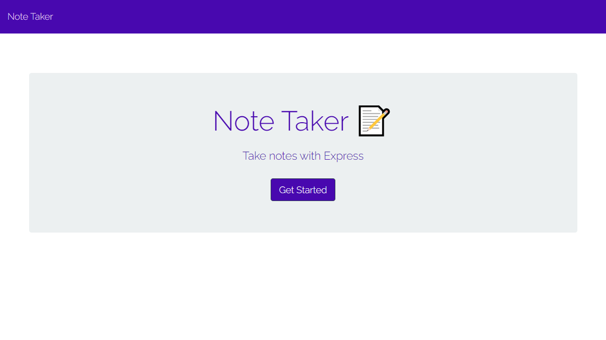
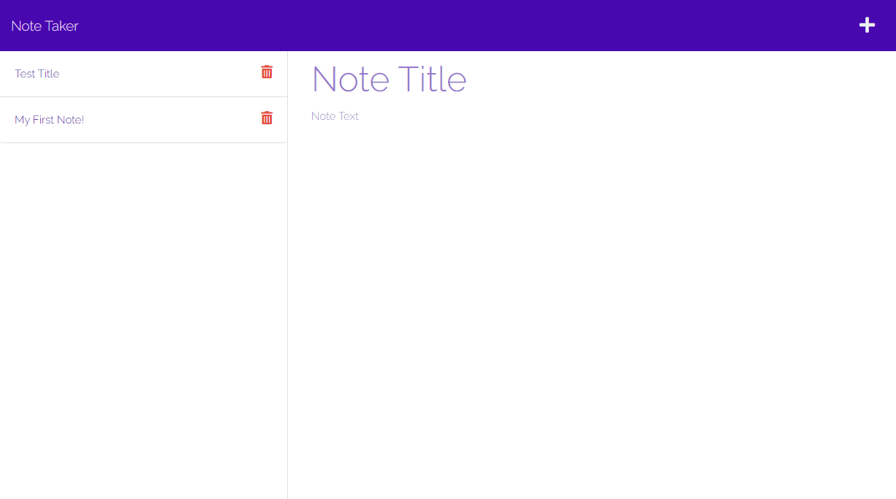

# NOTE TAKER

## Description 

### **Requirer**
Requirer is used in this project as a dependency management tool to manage the project's dependencies. It simplifies the process of installing and updating dependencies by providing a centralized way to manage them. This helps to ensure that the project uses the correct versions of its dependencies and that they are up-to-date.

## Table of Contents 

* [Installation](#installation)
* [Usage](#usage)
* [Credits](#credits)
* [License](#license)

## Installation

**Install or open the internet browser of your choice.**

*  **Examples Below:**

- Google Chrome
- Safari
- OPera
- Mozilla Firefox
- Internet Explorer

# Usage 

## Click Link below:

[Visit Note Taker](https://deploy-my-note-taker.herokuapp.com/)

## Images

# Video guide

- [cruzkenneth504-Youtube]() 

## License

## Credits
 - 

## Badges

## **Author**

* **Kenneth Cruz** 
- [Link to Repo] (https://github.com/Cruzkenneth504/note-taker)
- [Link to Github](https://github.com/cruzkenneth504)
- [Link to LinkedIn](linkedin.com/in/cruzkenneth504)

## **Acknowledgments**

* [UCB BootCamp](https://bootcamp.berkeley.edu/)
* [DevTools](https://dev.to/)
* [Youtube](https://www.youtube.com/)
* [Bootcamp Inatructors](https://bootcamp.berkeley.edu/)
* [Tutors]( https://tinyurl.com/BootCampTutorTeam)
 

## Test video

- [cruzkenneth504-Youtube-Jest]() 

